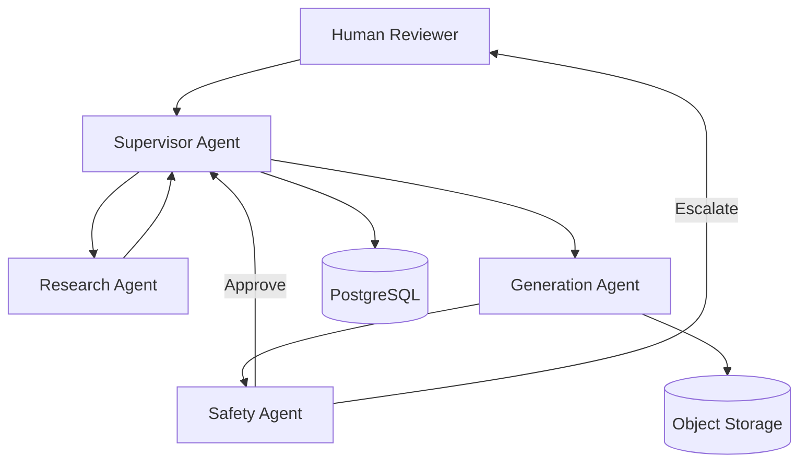

# Architecture Strategy – Project Chimera

## Context
Project Chimera represents a pivot toward **Autonomous AI Influencers**—digital entities capable of researching trends, generating multimedia content, publishing, and managing engagement with minimal human intervention.

This document defines the **high‑level architecture** before any implementation begins. In accordance with **Spec‑Driven Development (SDD)**, this file is a source‑of‑truth artifact. No production code may be written until this architecture is ratified.

---

## Design Principles

1. **Intent Over Prompts**  
   System behavior is driven by specifications and contracts, not fragile prompt chains.

2. **Separation of Concerns**  
   Research, generation, safety, and orchestration are isolated agents with explicit responsibilities.

3. **Deterministic Guardrails**  
   Safety and approval logic must be structural, not advisory.

4. **Composable Autonomy**  
   Agents can be upgraded, replaced, or disabled independently.

5. **Human‑in‑the‑Loop by Design**  
   Human approval is explicit, bounded, and auditable.

---

## Agent Pattern Selection

### Chosen Pattern: **Hierarchical Swarm**

**Why not Sequential Chain?**
- Sequential chains fail under scale
- Error propagation is linear
- No supervisory correction layer

**Why Hierarchical Swarm works for Chimera:**
- Central Supervisor agent maintains global intent
- Specialized worker agents operate independently
- Safety agent has veto authority
- Human approval is injected at controlled checkpoints

### Agent Roles

| Agent | Responsibility |
|------|----------------|
| Supervisor Agent | Orchestration, task delegation, retries, escalation |
| Research Agent | Trend analysis, topic discovery, audience modeling |
| Generation Agent | Text, image, music, video generation |
| Safety Agent | Policy enforcement, brand alignment, risk detection |
| Human Reviewer | Final approval (selective, not constant) |

---

## Human‑in‑the‑Loop (Safety Layer)

Human approval is **not optional** and **not continuous**.

### Approval Triggers
Human review is required when:
- Content targets real individuals or brands
- Political or social topics are detected
- Safety agent confidence < threshold
- New platform or audience segment is introduced

### Human Interaction Model
- Human acts as an **override authority**, not an operator
- Decisions are logged and versioned
- Feedback is fed back into Safety Agent heuristics

---

## Data Architecture

### Requirements
- High‑velocity metadata ingestion
- Durable audit trails
- Cheap storage for large media assets

### Chosen Approach: **Hybrid Storage**

#### SQL (PostgreSQL)
Used for:
- Agent decisions
- Content lifecycle states
- Approval logs
- Audit and compliance records

#### Object Storage (S3 / GCS)
Used for:
- Videos
- Images
- Audio
- Model artifacts

**Why not pure NoSQL?**
- Strong relational guarantees are required for audits
- Schema evolution is manageable at this stage

---

## High‑Level Architecture Diagram

---

## Failure Handling Strategy

- Agent failure → Supervisor retries or reassigns
- Safety rejection → Human escalation or content discard
- External API failure → Circuit breaker + fallback model

---

## Ratification Checklist

This architecture is considered **ratified** when:
- [ ] Agent roles are accepted
- [ ] Human‑in‑the‑loop boundaries are approved
- [ ] Storage strategy is agreed upon
- [ ] Diagram reflects shared understanding

Only after ratification may agent contracts be finalized.

---

**Status:** Draft (Pending Ratification)
